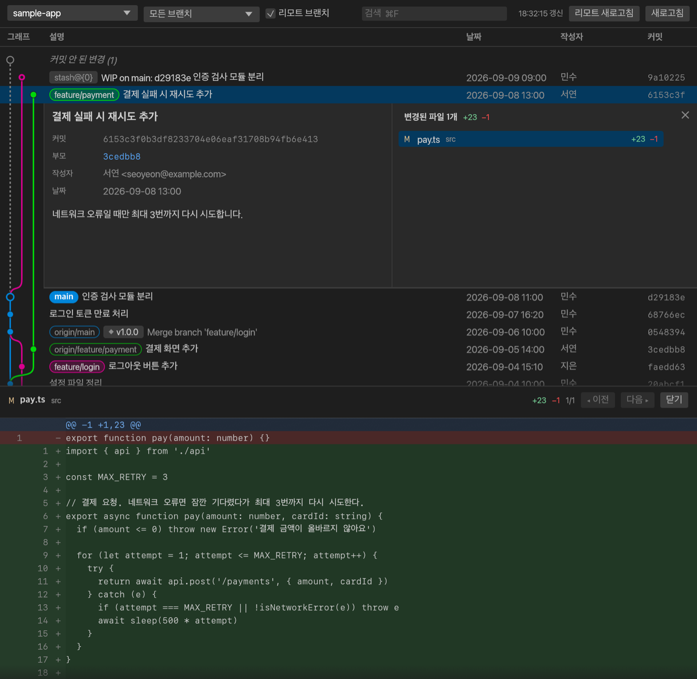

# ggl

커밋 그래프를 가볍게 띄워두고 보는 macOS 앱입니다. VS Code 확장 [Git Graph](https://github.com/mhutchie/vscode-git-graph)처럼 보여줘요.
*A lightweight commit graph viewer for macOS, inspired by the Git Graph extension for VS Code.*



- 커밋 그래프, 커밋 상세, diff
- 파일 트리, 파일 편집, 내용 검색
- 체크아웃·풀·푸시·머지·체리픽
- 저장소가 바뀌면 자동으로 새로고침해요. 가만히 있을 때 CPU는 0%예요.

> 비공식 앱이에요. 원본 Git Graph(mhutchie)와는 관계없고, 원본 코드 없이 Rust로 새로 만들었어요.

## 설치

```sh
curl -fsSL https://raw.githubusercontent.com/NeatKYU/ggl/main/install.sh | sh
```

- 다시 실행하면 최신 버전으로 바뀌어요.
- 디스크 이미지로 받으려면 [Releases](../../releases/latest)에서 `.dmg`를 받으세요. 처음 열 때 막히면 `시스템 설정 → 개인정보 보호 및 보안 → 그래도 열기`를 눌러요.
- 직접 빌드하려면 [Rust](https://rustup.rs)를 설치하고 `./bundle.sh --install`을 실행해요.

## 사용법

```sh
ggl-open .           # 현재 폴더의 저장소 열기
ggl-open --files .   # 파일 트리를 펼친 채로 열기
```

- 같은 저장소를 연 창이 있으면 그 창을 앞으로 가져와요.
- 커밋을 클릭하면 상세가 열리고, 파일을 클릭하면 diff가 열려요.
- 커밋을 더블클릭하면 체크아웃, 오른쪽 클릭하면 풀·푸시·머지·체리픽·복사 메뉴가 나와요.
- 풀·푸시·머지·체리픽은 확인을 받은 뒤에 실행해요. 강제 푸시는 하지 않아요.
- 파일 트리나 검색에서 연 파일은 `편집`을 눌러서 고칠 수 있어요.

## 단축키

| 키 | 동작 |
|---|---|
| `⌘R` | 새로고침 |
| `⌘⇧R` | 리모트 새로고침 (`git fetch --all --prune`) |
| `⌘F` | 커밋 검색 |
| `⌘⇧F` | 파일 내용 검색 |
| `⌘B` | 파일 트리 보기/숨기기 |
| `⌘H` | HEAD로 이동 |
| `⌘O` | 폴더 열기 |
| `⌘S` | 편집 중인 파일 저장 |
| `↑` `↓` | 커밋 이동 |
| `Esc` | 열린 패널 닫기 |

## herdr에서 열기

```sh
herdr plugin link /path/to/ggl/herdr
```

`~/.config/herdr/config.toml`에 아래를 추가하고 `herdr server reload-config`를 실행해요.

```toml
[[keys.command]]
key = "prefix+f"
type = "plugin_action"
command = "ggl.open-files"
description = "ggl 파일트리 열기"
```
